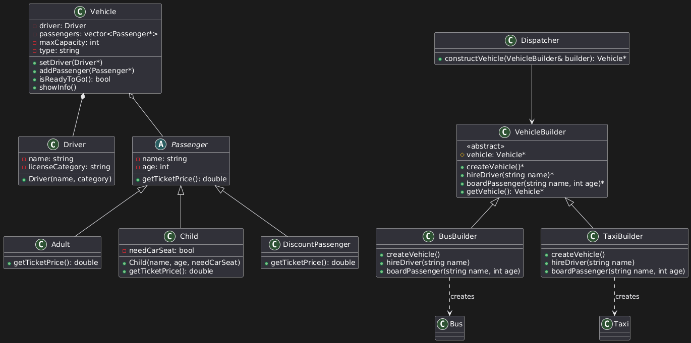
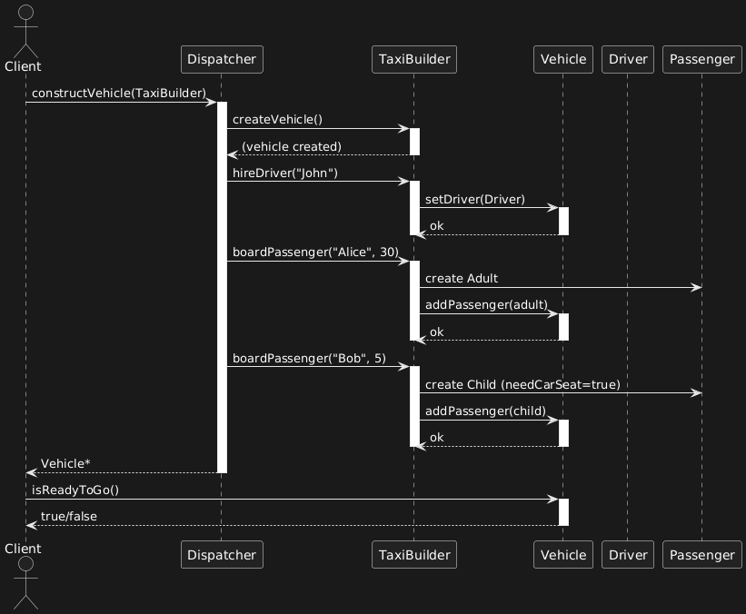

@startuml
class Driver {
    -name: string
    -licenseCategory: string
    +Driver(name, category)
}

abstract class Passenger {
    -name: string
    -age: int
    +getTicketPrice(): double
}

class Adult {
    +getTicketPrice(): double
}

class Child {
    -needCarSeat: bool
    +Child(name, age, needCarSeat)
    +getTicketPrice(): double
}

class DiscountPassenger {
    +getTicketPrice(): double
}

class Vehicle {
    -driver: Driver
    -passengers: vector<Passenger*>
    -maxCapacity: int
    -type: string
    +setDriver(Driver*)
    +addPassenger(Passenger*)
    +isReadyToGo(): bool
    +showInfo()
}

class VehicleBuilder {
    <<abstract>>
    #vehicle: Vehicle*
    +createVehicle()*
    +hireDriver(string name)*
    +boardPassenger(string name, int age)*
    +getVehicle(): Vehicle*
}

class BusBuilder {
    +createVehicle()
    +hireDriver(string name)
    +boardPassenger(string name, int age)
}

class TaxiBuilder {
    +createVehicle()
    +hireDriver(string name)
    +boardPassenger(string name, int age)
}

class Dispatcher {
    +constructVehicle(VehicleBuilder& builder): Vehicle*
}

Vehicle *-- Driver
Vehicle o-- Passenger
Passenger <|-- Adult
Passenger <|-- Child
Passenger <|-- DiscountPassenger

VehicleBuilder <|-- BusBuilder
VehicleBuilder <|-- TaxiBuilder
BusBuilder ..> Bus : creates
TaxiBuilder ..> Taxi : creates

Dispatcher --> VehicleBuilder
@enduml

@startuml
actor Client
participant Dispatcher
participant TaxiBuilder
participant Vehicle
participant Driver
participant Passenger

Client -> Dispatcher: constructVehicle(TaxiBuilder)
activate Dispatcher

Dispatcher -> TaxiBuilder: createVehicle()
activate TaxiBuilder
TaxiBuilder --> Dispatcher: (vehicle created)
deactivate TaxiBuilder

Dispatcher -> TaxiBuilder: hireDriver("John")
activate TaxiBuilder
TaxiBuilder -> Vehicle: setDriver(Driver)
activate Vehicle
Vehicle --> TaxiBuilder: ok
deactivate Vehicle
deactivate TaxiBuilder

Dispatcher -> TaxiBuilder: boardPassenger("Alice", 30)
activate TaxiBuilder
TaxiBuilder -> Passenger: create Adult
TaxiBuilder -> Vehicle: addPassenger(adult)
activate Vehicle
Vehicle --> TaxiBuilder: ok
deactivate Vehicle
deactivate TaxiBuilder

Dispatcher -> TaxiBuilder: boardPassenger("Bob", 5)
activate TaxiBuilder
TaxiBuilder -> Passenger: create Child (needCarSeat=true)
TaxiBuilder -> Vehicle: addPassenger(child)
activate Vehicle
Vehicle --> TaxiBuilder: ok
deactivate Vehicle
deactivate TaxiBuilder

Dispatcher --> Client: Vehicle*
deactivate Dispatcher

Client -> Vehicle: isReadyToGo()
activate Vehicle
Vehicle --> Client: true/false
deactivate Vehicle
@enduml

